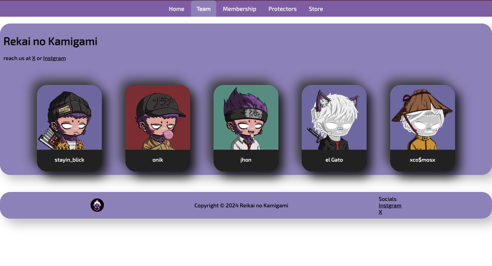
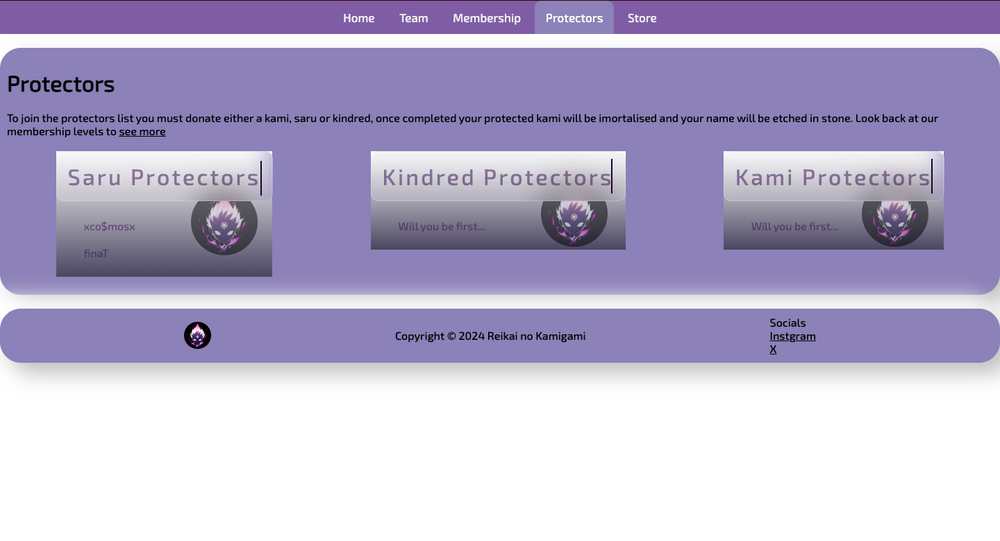
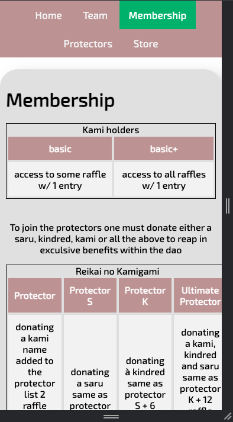
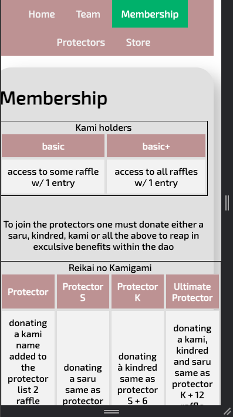
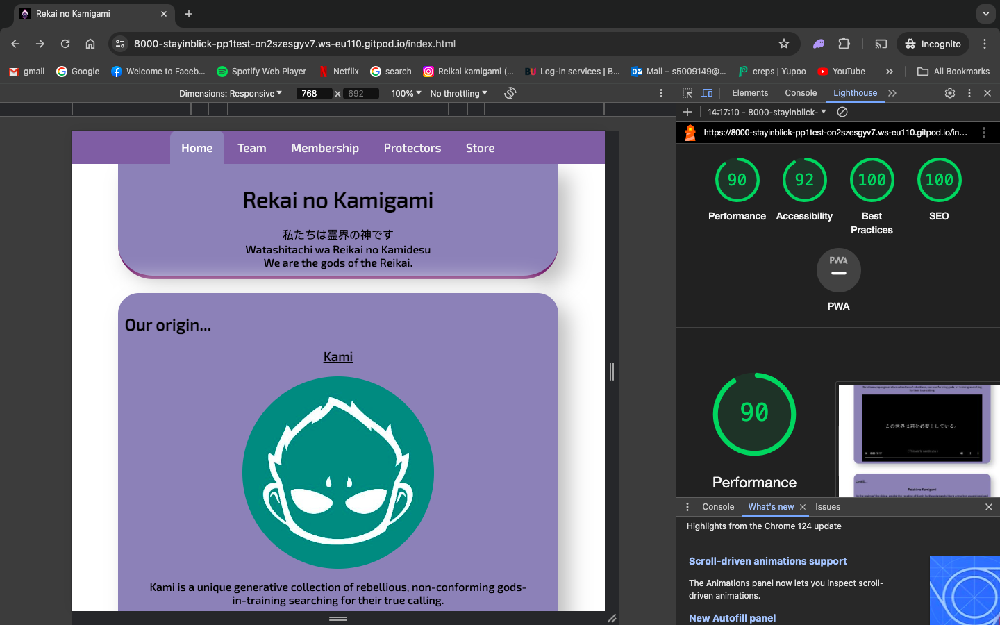

# Reikai no Kamigami

Reikai no kamigami is to inform the members and non-member of the community DAO (decentralized autonomous organization), about the updates revolving the DAO.

users of the website will be able to find all the information they need, ways to contact through social media, the members of the team and membership quries. the site is targeted towards those that interact with web3.

## Features

- Navbar
  - At the top of the site, states the different areas of the site, team, membership etc...
  - white text colour contrast against purple
  - Active page notch, to subtle tell the user what page they are on

- Origin
  - Features kami logo and link to official kami website
  - Features kami opening video preloaded

- until
  - Reikai no kamigami intro
  - Image

- Team
  - Provides Reikai no kamigami social links
  - Displays team members names and profile pics

- Membership
  - Displays the differenet levels of membership and what to do

- Protectors
  - Higlights current protectors, each type of protector has their own board

- Store
  - teases to users that theres an online shop comming soon

## Testing

- I tested this page on a laptop in google chrome
- Manually checked if site was responsive
- I also tested opening the site on an iphone 12pro using safari

## Bugs

- whilst tinkering with my navbar the first approach i took was using anchor tags but due to styling using the float property since it took it out of the normal flow my height was inactive and therefore background color didnt show. to resolve this i changed my anhors to lists

- when styling the table orginally my layout was (picture below) and that one column wasnt fitting on the page on small devices therefore i changed the layout with the table head on the left and table data displayed to the right instead of underneath

- issues with absolute links not displaying switched to relative links

## Validator Testing

HTML

- No errors were returned when passing through the officail W3C validator

CSS

- No errors were returned when passing through the officail (jigsaw) validator

Accessibility

- I confirmed that the colours and fonts are easy to read and accesible by running it through lighthouse in devtools

## Unfixed Bugs

- None

## Deployment

- This site was deployedd to GitHub pages. The steps to deploy are as follows:
  - In the Github repository, navigate to the settings tab
  - from the source section drop-down menu, select master branch
  - Once the master branch has been selcetced, the page provided the link to the completed website

The live link can be found here - [depolyed site link](https://stayin-blick.github.io/reikai-no-kamigami-pp1/)

## Credits

### Media

- thanks to Onik using ai generation to produce kamiko images
- thanks to each team member for profile pictures
- thanks to Kami nft for sharing images
